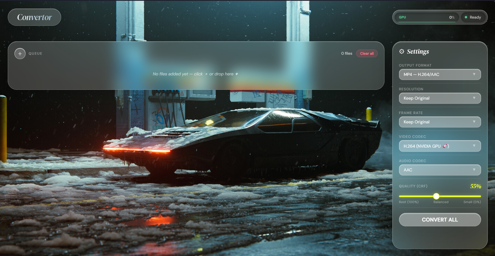

# Lens Video Converter 🎬✨

**Lens Video Converter** is a premium, high-performance desktop application for seamless video conversion. Built with a stunning **Glassmorphism UI** and powered by the industrial-strength **FFmpeg** engine, Lens offers a state-of-the-art experience for both casual users and video professionals.



---

## 💎 Design Philosophy
Lens is built on the principle of **"Aesthetics meets Performance."** The interface features:
- **Frosted Glass Components**: A breathable, translucent UI that adapts to your desktop.
- **Dynamic Neon Accents**: HSL-based glow effects that respond to conversion progress and system health.
- **Micro-Animations**: Smooth transitions and interactive elements for a truly premium feel.

---

## 🌟 Key Features

### 🚀 High-Performance Engine
- **Hardware Acceleration**: Automatic detection and utilization of **NVIDIA NVENC** (H.264/HEVC) for lightning-fast encoding.
- **Smart Logic**: Intelligent fallback to ultra-optimized CPU encoding (libx264/libx265) when dedicated hardware is unavailable.
- **Multi-Format Mastery**: Support for MP4, MKV, MOV, WebM, AVI, MP3, AAC, WAV, and even high-quality GIF creation.

### 📊 Real-time Monitoring
- **GPU Analytics**: Live utilization graphs for NVIDIA GPUs, providing insight into your hardware performance.
- **Precision Tracking**: Granular progress bars with dynamic color-coded feedback and accurate ETA calculations.
- **Glass Dropdowns**: Custom-built, aesthetic selection menus that maintain design consistency.

### 🛡️ Professional Workflow
- **Batch Processing**: Effortlessly manage a queue of multiple files with simple drag-and-drop.
- **Native Experience**: Integrated "Save As" flow using native OS dialogs for secure and familiar file management.
- **Privacy First**: All conversion happens locally on your machine—no data ever leaves your computer.

---

## 🛠️ Technology Stack

- **Frontend**: Vanilla HTML5, CSS3 (Modern Glassmorphism), and JavaScript (ES6+).
- **Runtime**: [Electron](https://www.electronjs.org/) (High-performance desktop framework).
- **Core Engine**: [FFmpeg](https://ffmpeg.org/) (Industrial-standard multimedia framework).
- **Utilities**: [Jest](https://jestjs.io/) (Robust unit testing), `ffmpeg-static` (Self-contained binaries).

---

## 🚀 Getting Started

### Prerequisites
- [Node.js](https://nodejs.org/) (v16.x or higher)
- [NVIDIA Drivers](https://www.nvidia.com/Download/index.aspx) (Optional, for hardware acceleration)

### Installation
1.  **Clone the Repository**
    ```bash
    git clone https://github.com/yourusername/lens-video-converter.git
    cd lens-video-converter
    ```
2.  **Install Dependencies**
    ```bash
    npm install
    ```
3.  **Launch the App**
    ```bash
    npm start
    ```

### Building for Production
Create a standalone executable for Windows:
```bash
npm run dist
```

---

## 📖 How to Use

1.  **Add Files**: Drag and drop videos into the landing zone or click the "Add Files" button.
2.  **Configure**: Use the side panel to select your desired output format, resolution, and quality.
3.  **Convert**: Click the "Convert" button. You'll see real-time progress and GPU metrics.
4.  **Save**: Once finished, click **"Save As..."** on each file to export it to your chosen location.

---

## 🤝 Contributing
Contributions are welcome! If you have a suggestion that would make this app better, please fork the repo and create a pull request. You can also simply open an issue with the tag "enhancement".

1. Fork the Project
2. Create your Feature Branch (`git checkout -b feature/AmazingFeature`)
3. Commit your Changes (`git commit -m 'Add some AmazingFeature'`)
4. Push to the Branch (`git push origin feature/AmazingFeature`)
5. Open a Pull Request

---

## 📜 License
Distributed under the **ISC License**. See `LICENSE` for more information.

---

*Developed with ❤️ by the Lens Team.*
